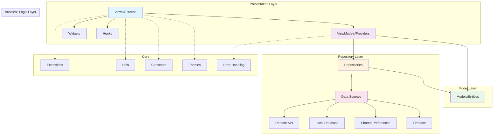

# Flutter Application Architecture Guide

## Overview

This document outlines the recommended architecture pattern for Flutter applications using a simplified 4-layer MVVM (Model-View-ViewModel) pattern. This approach ensures scalability, maintainability, and testability while keeping the architecture simple and focused.

## Architecture Pattern: Simplified MVVM (4 Layers)

### Architecture Diagram



## Layer Responsibilities

### 1. Presentation Layer (Views/Screens)

#### Views/Screens
- **Responsibility**: UI rendering and user interaction handling
- **Components**: Screens, Pages, Dialogs
- **Rules**:
  - must be stateless
  - Mostly Use `HookConsumerWidget` or `ConsumerWidget`
  - Handle only UI logic
  - No business logic
  - No direct data access
  - Communicate only with ViewModels/Providers
  - Define controllers using `useTextEditingController`
  - Use `useState` for simple state management
  - Use `useEffect` for side effects
  - Use `useMemo` for memoization

#### Body Widget Structure Rules
- **Keep the body widget lean and organized**
- **The body widget must not contain any Rows or Columns except the root level scrollable widget**
- **Break down complex UI into private widget classes**
- **Use composition over large widget trees**

```dart
class LoginScreen extends HookConsumerWidget {
  static String get routeName => 'login';
  static String get routeLocation => '/$routeName';
  
  const LoginScreen({super.key});
  
  @override
  Widget build(BuildContext context, WidgetRef ref) {
    // Hooks at the top
    final emailController = useTextEditingController(
      text: kDebugMode ? 'atif@gmail.com' : null,
    );
    final passwordController = useTextEditingController(
      text: kDebugMode ? '123456' : null,
    );
    
    // Provider watches - only watch ViewModels/Providers
    final authState = ref.watch(authProvider);
    final isLoading = authState.isLoading;
    
    // Effects
    useEffect(() {
      SystemChrome.setSystemUIOverlayStyle(SystemUiOverlayStyle.light);
      return SystemChrome.restoreSystemUIOverlays;
    }, []);
    
    return Scaffold(
      body: Column(
        children: [
          PrimaryTextField(
            controller: emailController,
            title: 'Email',
            validator: Validators.emailValidator,
          ),
          PrimaryTextField(
            controller: passwordController,
            title: 'Password',
            validator: Validators.passwordValidator,
            obscureText: true,
          ),
          PrimaryButton(
            onTap: () => _handleLogin(ref, emailController.text, passwordController.text),
            text: 'Login',
          ),
        ],
      ),
    );
  }
}


class DetailScreen extends HookConsumerWidget {
  static String get routeName => 'details';
  static String get routeLocation => '/$routeName';
  
  const DetailScreen({super.key});
  
  @override
  Widget build(BuildContext context, WidgetRef ref) {
    return Scaffold(
      appBar: AppBar(title: Text('Details')),
      body: SingleChildScrollView(  // Only root level scrollable widget allowed
        padding: EdgeInsets.all(16),
        child: Column(  // Only Column/Row allowed at root level
          crossAxisAlignment: CrossAxisAlignment.start,
          children: [
            // ✅ Break down into private widgets
            _ImageSection(movieShow: movieShow),
            _VenueAndMovieName(movieShow: movieShow),
            ...
            ...
            ...
          ],
        ),
      ),
    );
  }
}

// ✅ CORRECT: Private widgets for complex UI sections
class _ImageSection extends StatelessWidget {
  final MovieShowModel movieShow;
  const _ImageSection({required this.movieShow});

  @override
  Widget build(BuildContext context) {
    return Stack(
        children: [
            ...
            ...
            ...
        ],
      );
  }
}

class _VenueAndMovieName extends StatelessWidget {
  const _VenueAndMovieName({required this.movieShow});
  final MovieShowModel movieShow;

  @override
  Widget build(BuildContext context) {
    return Column(
      crossAxisAlignment: CrossAxisAlignment.start,
      children: [
        ... 
        ...
      ],
    );
  }
}


// ❌ WRONG: Don't put complex Rows/Columns directly in body
class BadExample extends HookConsumerWidget {
  @override
  Widget build(BuildContext context, WidgetRef ref) {
    return Scaffold(
      body: Column(  // ❌ This is getting too complex
        children: [
          Row(  // ❌ Complex Row in body
            children: [
              Column(  // ❌ Nested Column in body
                children: [
                  // ... many widgets
                ],
              ),
              Column(  // ❌ Another nested Column
                children: [
                  // ... many widgets
                ],
              ),
            ],
          ),
          // ... more complex widgets
        ],
      ),
    );
  }
}

#### Widgets
- **Responsibility**: Reusable UI components
- **Components**: Custom widgets, compound widgets
- **Rules**:
  - Should be highly reusable
  - Parameterized for customization
  - No business logic
  - Focus on single responsibility
  - Use `PrimaryButton` for buttons
  - Use `PrimaryTextField` for text fields
  - Use `PrimaryCard` for cards
  - Use `PrimaryErrorWidget` for error messages
  - Use `PrimaryInfoWidget` for info messages
  - Use `PrimaryLoadingIndicator` for loading indicators
  - Use `PrimaryProgressIndicator` for progress indicators
  - Use `PrimarySheet` for sheets
  - Use `PrimaryTitledDropDown` for drop downs

#### Hooks
- **Responsibility**: Stateful logic encapsulation
- **Components**: Custom hooks for common patterns
- **Rules**:
  - Encapsulate stateful logic
  - Promote reusability
  - Handle lifecycle management

### 2. Business Logic Layer (ViewModels/Providers)

#### ViewModels/Providers - STRICT PROVIDER RULES
- **Responsibility**: State management and business logic coordination
- **Error Handling**: use the ref.showExceptionSheet(e) to show error messages from the ViewModel
- **HARD LIMIT**: Only use these provider types:
  - `NotifierProvider<T, State>` - For synchronous state management 
  - `AsyncNotifierProvider<T, State>` - For asynchronous state management
  - `StreamNotifierProvider<T, State>` - For stream-based state management
  - `FutureProvider<T, State>` - For simple data fetching (not in ViewModel layer)
  - `StreamProvider<T, State>` - For simple stream data (not in ViewModel layer)

**FORBIDDEN PROVIDERS IN VIEWMODEL LAYER:**
- ❌ `StateProvider` 
- ❌ `StateNotifierProvider` 
- ❌ `ChangeNotifierProvider`
- ❌ `FutureProvider`
- ❌ `StreamProvider`
- ❌ `Provider` (except for dependency injection)

```dart
// ✅ CORRECT: Using NotifierProvider for ViewModel
final authProvider = NotifierProvider<AuthProvider, AsyncValue<void>>(() {
  return AuthProvider();
});

class AuthProvider extends Notifier<AsyncValue<void>> {
  @override
  AsyncValue<void> build() {
    return const AsyncValue.data(null);
  }

  Future<void> login(String email, String password) async {
    state = const AsyncValue.loading();
    try {
      // Business logic coordination
      final user = await ref.read(authRepositoryProvider).login(email, password);
      
      // Update other providers/state
      ref.read(sharedPreferencesProvider).saveUser(user);
      await ref.read(routerProvider).navigateBasedAuthStatus();
      
      state = const AsyncValue.data(null);
    } catch (e, s) {
      state = AsyncValue.error(e, s);
      ref.showExceptionSheet(e);
    }
  }

  ... other methods
}

// ✅ CORRECT: Using AsyncNotifierProvider for async ViewModels
final userProfileProvider = AsyncNotifierProvider<UserProfileNotifier, UserProfile>(() {
  return UserProfileNotifier();
});

class UserProfileNotifier extends AsyncNotifier<UserProfile> {
  @override
  Future<UserProfile> build() async {
    final userId = ref.watch(currentUserIdProvider);
    return ref.read(userRepositoryProvider).getUserProfile(userId);
  }

  Future<void> updateProfile(UserProfile profile) async {
    state = const AsyncValue.loading();
    try {
      final updatedProfile = await ref.read(userRepositoryProvider).updateProfile(profile);
      state = AsyncValue.data(updatedProfile);
    } catch (e, s) {
      state = AsyncValue.error(e, s);
    }
  }
}
```

**Rules for ViewModels/Providers:**
- Manage UI state and coordinate business operations
- Communicate with Repository layer
- Transform data for UI consumption
- Handle error states and loading states
- Coordinate between multiple repositories if needed
- Never directly access data sources

### 3. Model Layer (Models/Entities)

#### Models/Entities
- **Responsibility**: Data structure definition and business entities
- **Components**: Data classes, entities, value objects
- **Rules**:
  - Immutable data structures using Freezed
  - Include validation logic
  - JSON serialization support
  - Shared between ViewModels and Repositories

```dart
@freezed
abstract class AppUser with _$AppUser {
  const factory AppUser({
    String? userid,
    required String name,
    required String email,
    String? photoURL,
    required bool isEmailVerified,
  }) = _AppUser;

  const AppUser._();

  factory AppUser.fromJson(Map<String, dynamic> json) =>
      _$AppUserFromJson(json);

  factory AppUser.fromFirestore(Map<String, dynamic> json, String id) {
    return _$AppUserFromJson(json).copyWith(id: id);
  }
      
  // Custom methods for business logic
  bool get isProfileComplete => 
      name.isNotEmpty && email.isNotEmpty && photoURL != null;
      
  String get displayName => name.isEmpty ? email.split('@').first : name;
}
```

### 4. Repository Layer

#### Repositories
- **Responsibility**: Data access abstraction and coordination
- **Components**: Repository interfaces and implementations
- **Rules**:
  - Abstract data sources
  - Handle data transformation between data sources and models
  - Implement caching strategies
  - Error handling and retry logic
  - Return Models/Entities to ViewModels

```dart
// ✅ CORRECT: Repository provider (allowed Provider usage)
final authRepositoryProvider = Provider<AuthRepository>((ref) {
  final sharedPreferences = ref.read(sharedPreferencesProvider).prefs;
  return AuthRepository(sharedPreferences);
});

class AuthRepository {
  final SharedPreferences prefs;
  final FirebaseAuth _auth = FirebaseAuth.instance;
  final FirebaseFirestore _firestore = FirebaseFirestore.instance;
  
  AuthRepository(this.prefs);

  Future<AppUser> login(String email, String password) async {
    final userCredential = await _auth.signInWithEmailAndPassword(
      email: email,
      password: password,
    );

    if (userCredential.user == null) throw Exception('Failed to login');

    final userid = userCredential.user!.uid;
    final appUser = await _getFirestoreUser(userid);

    return appUser;
  }

  Future<AppUser> _getFirestoreUser(String userid) async {
    final userDoc = await _firestore.collection('users').doc(userid).get();
    if (userDoc.data() == null) throw Exception('User not found');
    return AppUser.fromJson(userDoc.data()!);
  }
}
```

## Project Structure

```
lib/
├── main.dart         # Entry point
├── my_app.dart       # App configuration  
├── app_theme.dart    # Theme configuration
├── models/           # Data models and DTOs using Freezed (Models/Entities layer)
├── providers/        # Riverpod providers and state management (ViewModels/Providers layer)
├── screens/          # UI screens and pages (Views/Screens layer)
├── widgets/          # Reusable UI components
├── hooks/            # Custom Flutter Hooks
├── utils/            # Utility functions and helpers
└── repositories/     # Data access layer (Repository layer)
```


## Communication Flow

### Data Flow Example (Login Process)

1. **View Layer**: `LoginScreen` captures user input
2. **ViewModel Layer**: `AuthProvider.login()` receives email/password
3. **Repository Layer**: `AuthRepository.login()` handles authentication
4. **Model Layer**: `AppUser` model represents the authenticated user
5. **Back to ViewModel**: `AuthProvider` updates state with user data
6. **Back to View**: `LoginScreen` reacts to state changes

```dart
// 1. View captures input and calls ViewModel
void _handleLogin(WidgetRef ref, String email, String password) {
  ref.read(authProvider.notifier).login(email, password);
}

// 2. ViewModel coordinates business logic
Future<void> login(String email, String password) async {
  state = const AsyncValue.loading();
  try {
    // 3. Repository handles data operations
    final user = await ref.read(authRepositoryProvider).login(email, password);
    
    // 4. Model represents the data
    // user is of type AppUser
    
    // 5. ViewModel updates state
    ref.read(sharedPreferencesProvider).saveUser(user);
    await ref.read(routerProvider).navigateBasedAuthStatus();
    state = const AsyncValue.data(null);
  } catch (e, s) {
    state = AsyncValue.error(e, s);
    ref.showExceptionSheet(e);
  }
}

// 6. View reacts to state changes
final authState = ref.watch(authProvider);
final isLoading = authState.isLoading;
```

## Provider Type Guidelines

### Allowed Provider Types by Layer

#### Dependency Injection (Any Layer)
```dart
// ✅ Provider - for dependency injection only
final httpClientProvider = Provider<http.Client>((ref) => http.Client());
final configProvider = Provider<AppConfig>((ref) => AppConfig.fromEnvironment());
```

#### ViewModel/Provider Layer ONLY
```dart
// ✅ NotifierProvider - for synchronous state management
final counterProvider = NotifierProvider<CounterNotifier, int>(() => CounterNotifier());

// ✅ AsyncNotifierProvider - for asynchronous state management  
final userProvider = AsyncNotifierProvider<UserNotifier, User>(() => UserNotifier());

// ✅ StreamNotifierProvider - for stream-based state management
final messagesProvider = StreamNotifierProvider<MessagesNotifier, List<Message>>(() => MessagesNotifier());
```

#### Data Layer (Simple Data Fetching)
```dart
// ✅ FutureProvider - for simple data fetching (not in ViewModel layer)
final configDataProvider = FutureProvider<Config>((ref) async {
  return ref.read(configRepositoryProvider).getConfig();
});

// ✅ StreamProvider - for simple stream data (not in ViewModel layer)
final timeProvider = StreamProvider<DateTime>((ref) {
  return Stream.periodic(Duration(seconds: 1), (_) => DateTime.now());
});
```

## Error Handling Architecture

### Error Types
1. **Network Errors**: Connection issues, timeouts
2. **Authentication Errors**: Invalid credentials, expired tokens
3. **Validation Errors**: Input validation failures
4. **Business Logic Errors**: Domain-specific errors

### Error Handling in ViewModels
```dart
class AuthProvider extends Notifier<AsyncValue<void>> {
  Future<void> login(String email, String password) async {
    state = const AsyncValue.loading();
    
    try {
      final user = await ref.read(authRepositoryProvider).login(email, password);
      // Handle success
      state = const AsyncValue.data(null);
    } on NetworkException catch (e) {
      state = AsyncValue.error('Network error: ${e.message}', StackTrace.current);
    } on AuthenticationException catch (e) {
      state = AsyncValue.error('Authentication error: ${e.message}', StackTrace.current);
      // Redirect to login if needed
    } catch (e, s) {
      state = AsyncValue.error(e, s);
    }
  }
}
```


## Performance Considerations

### 1. Provider Optimization
- Use `select` to watch specific parts of state
- Implement proper provider disposal with `autoDispose` when needed
- Avoid unnecessary provider rebuilds

### 2. Model Optimization
- Use `const` constructors in Freezed models
- Implement efficient `copyWith` methods
- Use proper equality checks

This simplified 4-layer architecture provides a clear separation of concerns while maintaining simplicity and enforcing strict rules for provider usage in the ViewModel layer. 